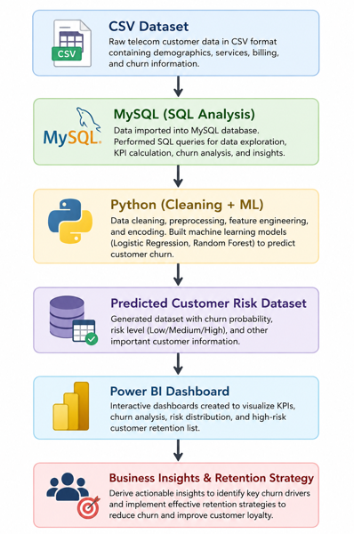
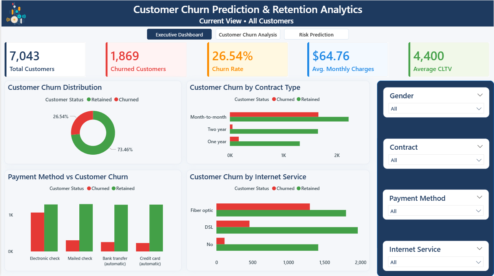
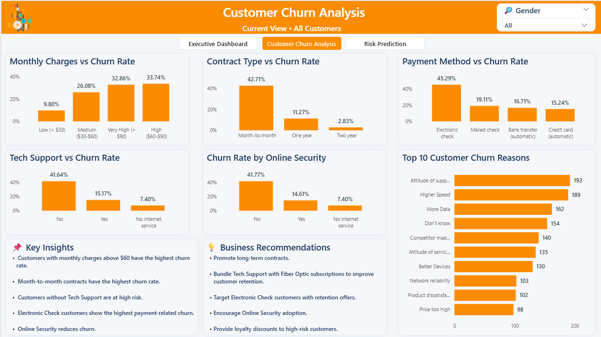
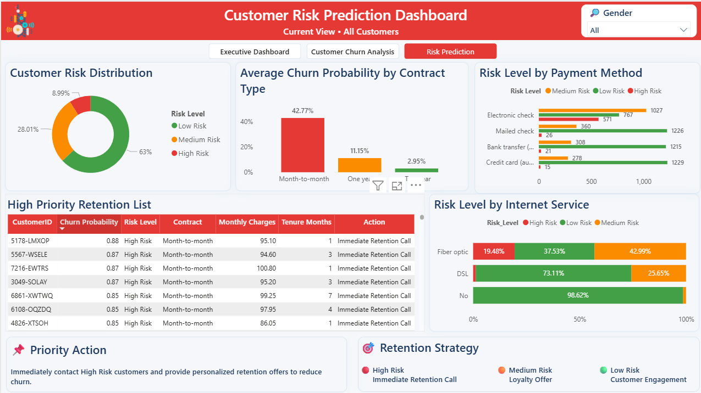

# 📊 Customer Churn Prediction & Retention Analytics

<p align="center">


</p>

---

# 📌 Project Overview

Customer churn is one of the biggest challenges faced by telecom companies, directly impacting customer retention and revenue.

This project presents an **end-to-end Customer Churn Prediction & Retention Analytics Solution** built using **SQL, Python, Machine Learning, and Power BI**.

The project analyzes telecom customer behavior, identifies the major factors responsible for churn, predicts high-risk customers using Machine Learning, and provides interactive dashboards with actionable business insights and retention strategies.

---

# 🎯 Project Objectives

- Analyze telecom customer behavior
- Identify major churn factors
- Perform SQL-based exploratory analysis
- Build Machine Learning models to predict churn
- Classify customers into Risk Levels
- Design interactive Power BI dashboards
- Provide business recommendations for customer retention

---

# 🛠️ Tech Stack

| Technology | Purpose |
|------------|----------|
| MySQL | Database Management & SQL Analysis |
| Python | Data Cleaning & Machine Learning |
| Pandas | Data Manipulation |
| NumPy | Numerical Computation |
| Matplotlib | Data Visualization |
| Scikit-Learn | Machine Learning Models |
| Power BI | Interactive Dashboard |
| Excel | Initial Data Cleaning |

---

# 🤖 Machine Learning Models

The following supervised learning models were implemented:

- Logistic Regression
- Random Forest Classifier

The models were trained to predict customer churn probability and classify customers into:

- 🟢 Low Risk
- 🟠 Medium Risk
- 🔴 High Risk

---

# 📈 Project Workflow

<p align="center">



</p>

---

# 📊 SQL Analysis

Performed exploratory SQL analysis including:

- Total Customers
- Churn Rate
- Churn by Contract Type
- Churn by Internet Service
- Churn by Payment Method
- Churn Reason Analysis
- KPI Calculations

---

# 🧹 Python Data Processing

Performed:

- Data Cleaning
- Missing Value Handling
- Label Encoding
- One-Hot Encoding
- Feature Engineering
- Train-Test Split
- Feature Scaling
- Model Training
- Model Evaluation
- Feature Importance Analysis
- Customer Risk Prediction

---

# 📊 Dashboard Pages

## 🏠 Executive Dashboard

Provides an overall business summary including KPIs, customer churn distribution, contract analysis, payment method analysis, and interactive filters.

<p align="center">



</p>

---

## 📈 Customer Churn Analysis

Analyzes the major drivers of churn through monthly charges, contract types, payment methods, online security, tech support, churn reasons, business insights, and recommendations.

<p align="center">



</p>

---

## 🎯 Risk Prediction Dashboard

Displays predicted customer risk levels, churn probability analysis, high-priority retention customers, and recommended business actions.

<p align="center">



</p>

---

# 📌 Key Business Insights

- Customers with Month-to-Month contracts have the highest churn rate.
- High Monthly Charges significantly increase churn probability.
- Electronic Check users churn more frequently.
- Customers without Tech Support are at greater risk.
- Lack of Online Security increases churn.
- Fiber Optic customers exhibit higher churn compared to DSL customers.
- High-risk customers can be proactively targeted using predicted churn probability.

---

# 💡 Business Recommendations

- Promote long-term contracts.
- Bundle Tech Support with Fiber Optic subscriptions.
- Encourage Online Security adoption.
- Target Electronic Check customers with retention offers.
- Prioritize High Risk customers for personalized engagement.
- Develop loyalty programs for medium-risk customers.

---

# 📂 Project Structure

```
Customer-Churn-Prediction-and-Retention-Analytics
│
├── Dashboard
│   └── Customer_Churn_Dashboard.pbix
│
├── Dataset
│   ├── telco_customer_churn.csv
│   └── customer_churn_with_risk.csv
│
├── Images
│   ├── 01_Dataset_Preview.png
│   ├── 02_SQL_Database_Table.png
│   ├── 03_SQL_KPI_Analysis.png
│   ├── 04_SQL_Contract_Analysis.png
│   ├── 05_Python_Data_Preprocessing.png
│   ├── 06_Machine_Learning_Model_Comparison.png
│   ├── 07_Feature_Importance.png
│   ├── 08_Executive_Dashboard.png
│   ├── 09_Customer_Churn_Analysis.png
│   ├── 10_Risk_Prediction_Dashboard.png
│   ├── 11_Dashboard_Navigation.png
│   └── 12_Project_Workflow.png
│
├── Notebook
│   └── churn_prediction.ipynb
│
├── Report
│   └── Customer_Churn_Prediction_and_Retention_Analytics_Report.pdf
│
├── SQL
│   └── churn_analysis.sql
│
└── README.md
```

---

# 🚀 How to Run the Project

### SQL

- Create the database
- Import the telecom dataset
- Execute the SQL script

### Python

Run:

```
Notebook/churn_prediction.ipynb
```

This will:

- Clean the data
- Train Machine Learning models
- Predict churn probability
- Generate the risk dataset

### Power BI

Open:

```
Dashboard/Customer_Churn_Dashboard.pbix
```

Refresh the dataset if required.

---

# 📈 Project Outcomes

✔ End-to-End Data Analytics Pipeline

✔ SQL-Based Business Analysis

✔ Machine Learning Churn Prediction

✔ Customer Risk Classification

✔ Executive Dashboard

✔ Business Insights

✔ Retention Strategy Recommendations

---

# 🔮 Future Enhancements

- Deploy prediction model using Flask/FastAPI
- Real-time churn prediction
- Automated customer alert system
- Cloud deployment using Azure or AWS
- Integration with CRM systems

---

# 👨‍💻 Author

**Abhishek Savita**

- GitHub: https://github.com/Abhishek-Savita-3012

---

## ⭐ If you found this project useful, consider giving it a Star!
